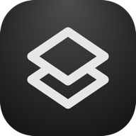
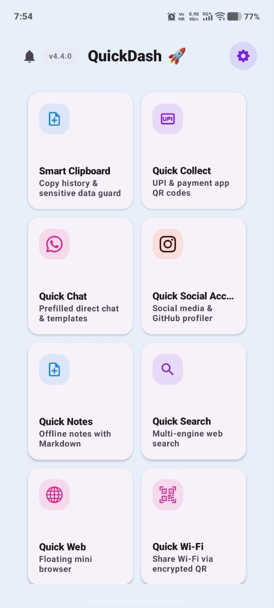
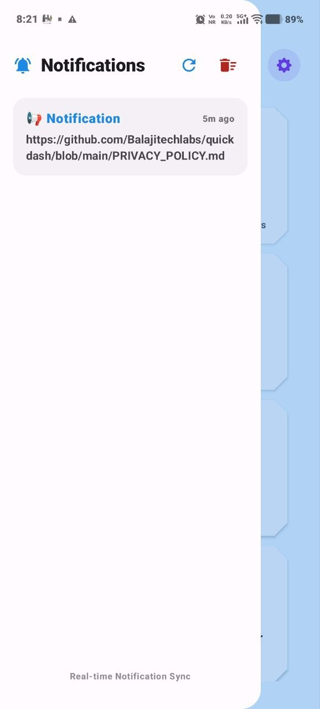
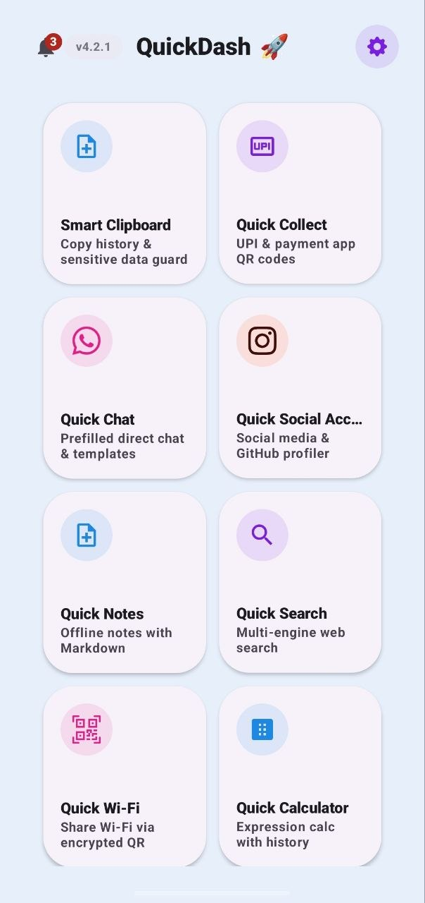
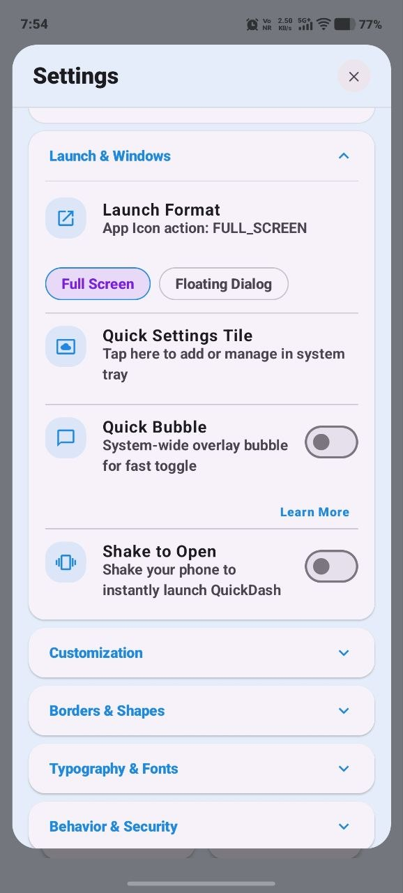
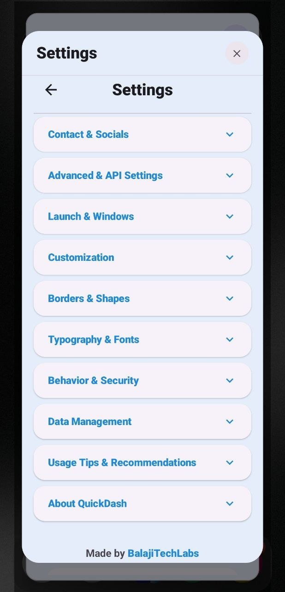

# QuickDash ⚡

**The Ultimate Floating Utility Hub for Android**
 
*Never switch apps again. All your essential tools, floating beautifully on your screen.*

 

**Latest Tag: `v4.4.1-10`**

 

---

## 📸 Screenshots

  
  
  
  
  

---

## 🚀 What is QuickDash?

**QuickDash** is a hyper-productive Android utility application engineered to drastically save your time and screen real estate. Instead of minimizing your current game, video, or app to open your notes, calculator, or QR generator, QuickDash lives as a **Floating Bubble** on your screen. Tap the bubble, and a gorgeous, blurred dashboard appears instantly with snappy `SizeTransform` animations, adapting dynamically to whatever tool you select.

## ✨ Core Features

### 🟢 The Floating Dashboard & Compliance
- **System-Wide Overlay:** Accessible over any app, game, or video.
- **Glassmorphic UI & Dynamic Animations:** Stunning Material 3 design with beautiful background blurs. Windows instantly snap and resize based on the tool.
- **App Lock:** Secure the dashboard using native device Biometrics (Fingerprint/Face).
- **100% Privacy Enforced:** Built without commercial third-party trackers. No Google Sign-In, no external ad SDKs. Total anonymity.

### 🛠 Elite Productivity Tools
- **📝 Quick Notes:** Jot down thoughts instantly. Backed by **Room Database** for crash-safe, persistent storage. Pin your most important notes to the top.
- **🌐 Quick Web (Floating Browser):** A mini floating browser inside the dashboard to search and navigate links without switching apps.
- **📋 Smart Clipboard Manager:** Track and retrieve your recently copied items. Features a dedicated Pinned section with one-click actions (Pin, Share, Copy, Delete).
- **⏱️ Advanced Timer:** Stopwatches with lap records and countdowns stored in a clean history log.
- **📊 Live Traffic Monitor:** View real-time device traffic alongside editable server credentials.
- **💾 Data Backup & Restore:** Export all your preferences, notes, and configs to a single JSON file and restore anytime.

### 💳 Fast Payments & Connectivity
- **PayPal & UPI Switcher:** Tap a single toggle to instantly flip your QR generator between PayPal payment links and UPI targets.
- **Categorized Target Divisions:** Set up customizable Division Slots (e.g. Groceries, Dining) for rapid payment target generation.
- **Wi-Fi Sharer:** Generate a Wi-Fi share QR with a direct scan-to-connect option natively built into the history logs.

### 💬 Frictionless Communication
- **WhatsApp Live QR Scanner:** Scan a friend's WhatsApp QR with Google ML Kit to instantly launch their chat without saving the number.
- **Direct Chat Launcher:** Fully supports **WhatsApp, Telegram, Signal, and SMS** with tab-specific prefilled message templates. Enter a number and jump straight to the chat.

### 🎨 State-of-the-art Personalization
- **Custom Font Families:** Hot-swap between Poppins, Space Grotesk, and Nunito on the fly.
- **11 Built-in Themes & Dynamic Color:** Handcrafted Material 3 palettes, plus Android 12+ wallpaper-based Monet styling.
- **Haptic Engine:** Premium localized vibration responses across the entire UI.

### 📣 Developer Zero-Cost Infrastructure
- **Diagnostic Crash Logger:** A built-in terminal that intercepts uncaught exceptions and logs them to the System Logs Screen for one-click sharing.
- **Telegram Bot Integration:** Intercepts remote broadcast announcements and collects app feedback without relying on expensive Firebase server architecture.

---

## 💻 Developer Setup & Building

Looking to build QuickDash from source? Please refer to our dedicated **[SETUP.md](SETUP.md)** for instructions on cloning, configuring required Telegram Bot credentials, and compiling via Android Studio.

---

## 📝 License
This project operates under a **Custom Open Source Fork License**. All derivative works must comply with the terms defined in the [LICENSE](LICENSE) file (including maintaining 100% open-source visibility and implementing major functional changes).

 

  
Made with ❤️ by <strong>BalajiTechLabs</strong>

