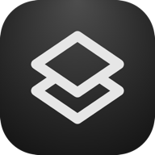

<p align="center">
  
</p>

<h1 align="center">QuickDash ⚡</h1>

<p align="center">
  <b>12 Floating Tools for Android — UPI QR, Translator, Clipboard, Notes, Calculator & More</b><br>
  <i>Zero tracking. On-device processing. Material Design 3.</i>
</p>

<p align="center">
  <a href="https://github.com/Balajitechlabs/quickdash/releases/latest">
    
  </a>
  <a href="https://play.google.com/store/apps/details?id=com.balajitechlabs.quickdash">
    
  </a>
  <a href="obtainium://app/https://github.com/Balajitechlabs/quickdash">
    
  </a>
  <a href="https://github.com/Balajitechlabs/quickdash/releases">
    
  </a>
</p>

<p align="center">
  
  
  
  
  
  
  
  
  
  
</p>

---

## What is QuickDash?

QuickDash is an **Android floating overlay utility hub** — a single persistent bubble that puts **12 tools** right on your screen, accessible from any app.

| Tool | Description |
|------|-------------|
| 🎯 **Radial Quick-Wheel** | 350ms long-press or swipe on the bubble to launch your top 4 pinned tools. |
| 📱 **Glance M3 Widgets** | Responsive Home Screen & Lock Screen widgets (1x1, 2x1 Quick Bar, 2x2 Hub). |
| 🔐 **Encrypted Backup** | AES-256-GCM encrypted `.qdbackup` export & restore with PBKDF2 passphrase protection. |
| 🔤 **Translator** | On-screen translation across 100+ languages. Runs entirely on-device. |
| 📋 **Clipboard** | Smart clipboard manager with history, favorites, and one-tap paste. |
| 📱 **UPI QR** | Generate UPI QR codes from any screen. Tap to scan or share. |
| 📝 **Notes** | Quick floating notes that sync with Room DB and clipboard. |
| 🔢 **Calculator** | Floating calculator for quick arithmetic without switching apps. |
| 📶 **Wi-Fi Share** | Share connected Wi-Fi credentials instantly as QR codes. |
| ⚖️ **Unit Converter** | Convert length, weight, temperature, currency, and more. |
| 👁️ **Text Extractor** | Extract text from images using on-device OCR (Optical Character Recognition). |
| 🎨 **Color Picker** | Pick colors from any screen area and copy hex/RGB values. |
| ⏱️ **Timer** | Floating countdown timer with preset intervals and AlarmManager exact alarms. |
| 🔋 **Battery Info** | View battery stats, health, and estimated remaining time. |
| 🧰 **Tool Drawer** | Quick-access drawer for all utilities in one place. |

> **Zero tracking. Zero ads. Zero telemetry.** Everything runs on your device.

---

## Installation

### Option 1: Download APK
Grab the latest APK from [GitHub Releases](https://github.com/Balajitechlabs/quickdash/releases/latest).

### Option 2: Play Store (Beta)
Join the beta on [Google Play](https://play.google.com/store/apps/details?id=com.balajitechlabs.quickdash).

### Option 3: Obtainium / F-Droid
- **Obtainium**: Add `https://github.com/Balajitechlabs/quickdash` to receive auto-updates.
- **F-Droid**: Recipe metadata included at `metadata/com.balajitechlabs.quickdash.yml`.

---

## Build from Source

```bash
git clone https://github.com/Balajitechlabs/quickdash.git
cd quickdash

# Debug build
./gradlew assembleDebug

# Release build
./gradlew assembleRelease

# Run tests
./gradlew testDebugUnitTest

# Lint
./gradlew lint
```

**Prerequisites:** Android Studio, JDK 17+, Android SDK 36+.

For detailed setup instructions, see [SETUP.md](SETUP.md).

---

## Tech Stack

| Component | Technology |
|-----------|-----------|
| Language | **Kotlin 2.2** |
| UI | **Jetpack Compose** + **Material Design 3** + **Glance Widgets** |
| Architecture | MVVM (Model-View-ViewModel) + Single-Activity Floating Dialog |
| DI | **Hilt** (Dagger) |
| Database & Storage | **Room DB**, **DataStore** (`UserStore`), **Proto DataStore** |
| Encryption | **AES-256-GCM** + **PBKDF2** |
| Networking | **OkHttp 4.12** |
| Min SDK | **API 24** (Android 7.0) |
| Target SDK | **API 36** (Android 16) |
| Build | **Gradle 9.5** with Kotlin DSL |
| CI/CD | **GitHub Actions** (6 workflows: PR checks, release, CodeQL, nightly, dependency scan, website) |

---

## Project Structure

```
quickdash/
├── app/                    # Android app module
├── website/                # Showcase website (React + GitHub Pages)
├── workers/                # Cloudflare Workers API
├── .github/                # CI/CD, issue templates, community files
├── release/                # Release process & notes
├── metadata/               # F-Droid store metadata
├── scripts/                # Developer helpers
├── .githooks/              # Pre-push secret detection
├── gradle/                 # Version catalog & wrapper
├── screenshots/            # Store listing screenshots
├── ARCHITECTURE.md         # Architecture deep-dive
├── CHANGELOG.md            # Version history
├── SETUP.md                # Developer setup guide
├── CONTRIBUTING.md         # How to contribute
├── SECURITY.md             # Security policy
└── LICENSE                 # Open source license
```

For a complete tour of the codebase, see [ARCHITECTURE.md](ARCHITECTURE.md).

---

## 👥 Contributors & Community

Thanks to all the wonderful contributors who help build and improve QuickDash!

<p align="center">
  <a href="https://github.com/Balajitechlabs/quickdash/graphs/contributors">
    
  </a>
</p>

Contributions of all kinds are warmly welcomed! Please read our [Contributing Guide](CONTRIBUTING.md) and [Developer Setup Guide](SETUP.md) to get started.

---

## License & Attribution

QuickDash is published under the **PocketOps Custom Open Source Fork License**.

- **Original Base:** Fork of [PocketOps](https://github.com/IIXII-L192/PocketOps-app) by Aakarsh (L192) / IIXII™.
- **Modifications:** Includes >30% major functional additions (details in [LICENSE](LICENSE)).
- **Compliance:** All original copyright notices are preserved.

© 2026 BalajiTechLabs. Free to use and open source.

---

<p align="center">
  <a href="https://quickdash.balajitechlab.com">Website</a> ·
  <a href="https://github.com/Balajitechlabs/quickdash/issues">Issues</a> ·
  <a href="https://github.com/Balajitechlabs/quickdash/discussions">Discussions</a> ·
  <a href="https://play.google.com/store/apps/details?id=com.balajitechlabs.quickdash">Play Store</a>
</p>
